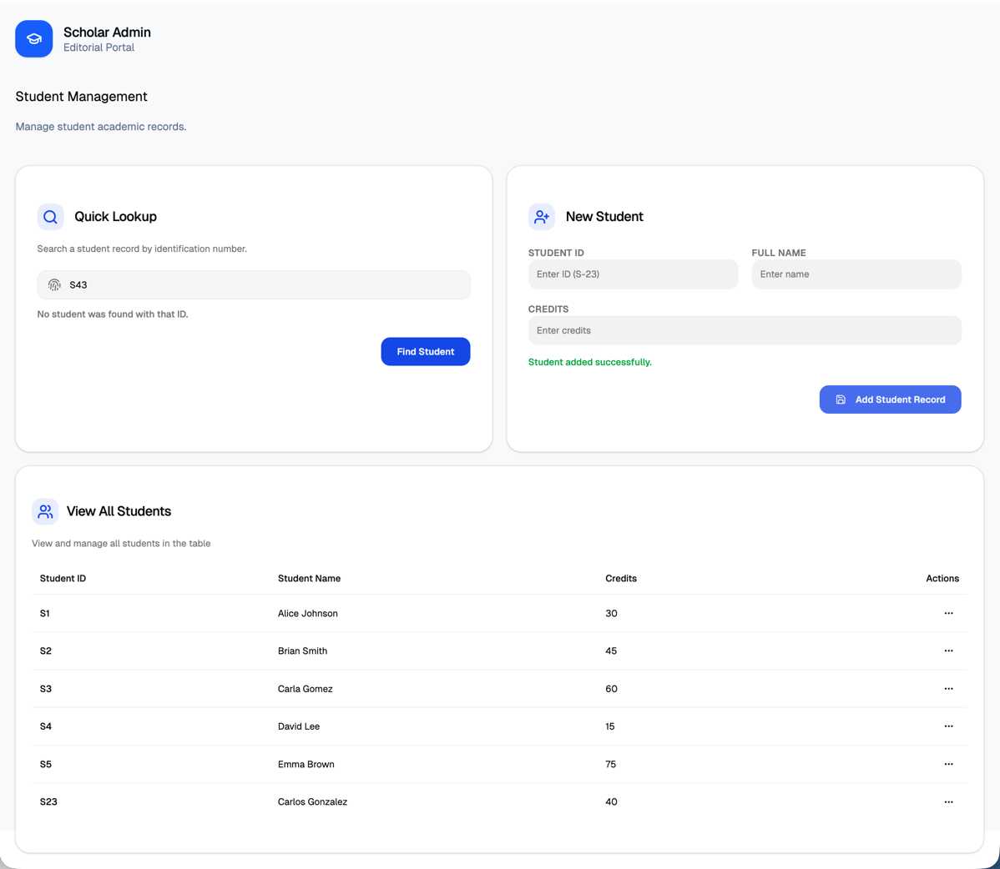
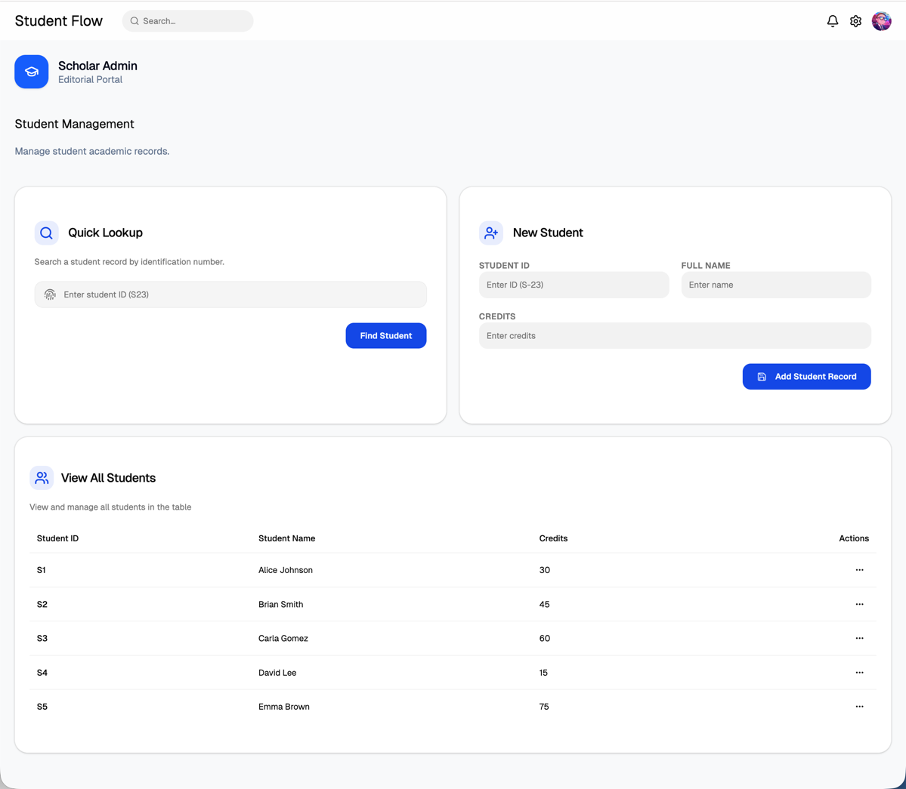
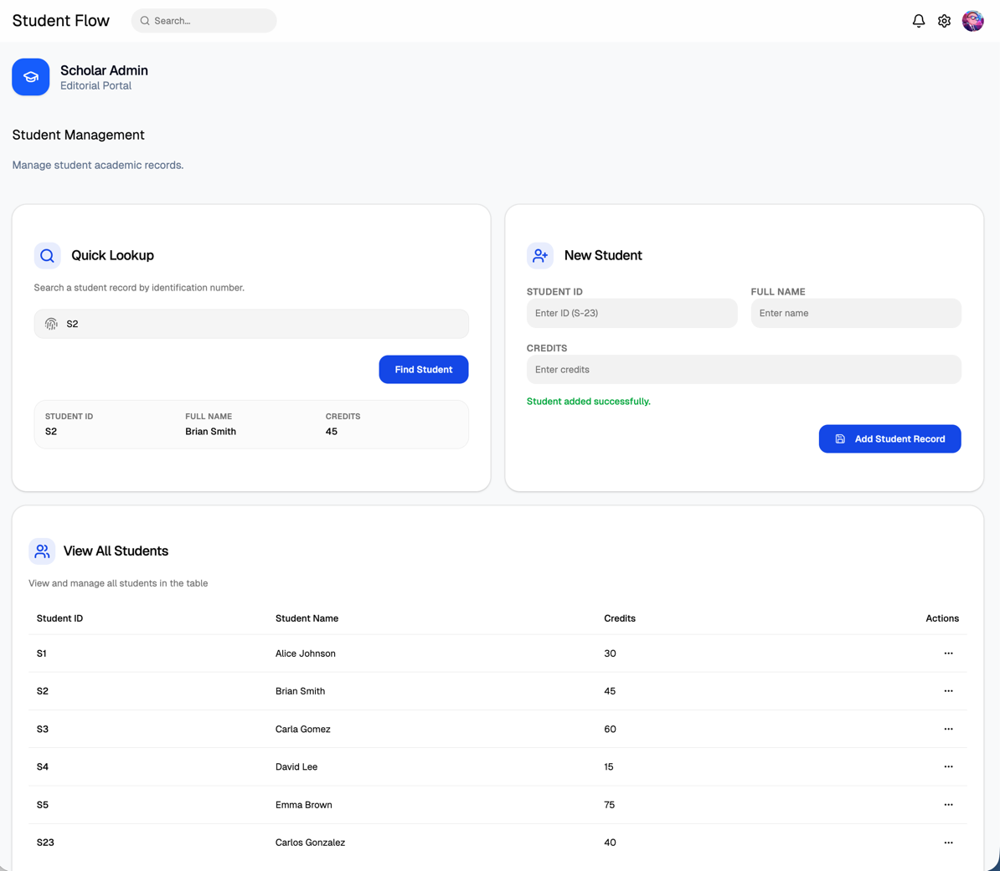
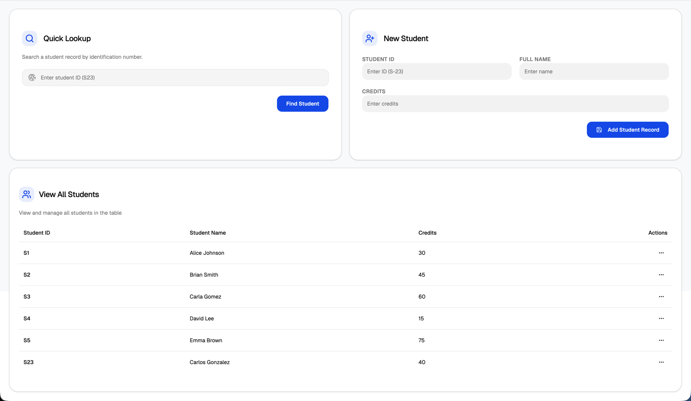

# Assignment 3

---
**SOEN 487** - Web Services and Applications - Concordia University

**Carlos Gonzalez** - 40204811

---

## Student Flow

> StudentFlow is a web-based Student Management System that allows users to manage academic student records through a simple and modern interface. The application connects a React frontend with a GraphQL backend powered by Apollo Server, Express.js, and MongoDB. It supports the core functionalities of retrieving all students, searching for a student by ID, and adding new student records, while also validating inputs such as student ID format and duplicate entries. The goal of the application is to demonstrate how GraphQL can be used to build a clean, efficient, and interactive full-stack system for managing structured data.

    
    
    
    

---

### Tech Stack
- **Frontend**

    - React
    - TypeScript
    - CSS
    - Vite
    - React Router
    - Apollo Client

- **Backend**

    - Node.js
    - Express
    - TypeScript
    - MongoDB
    - GraphQL
    - Apollo Server

---

## Setup Instructions

### 1. Open the Project
Open two terminal windows in the root project folder: `StudentFlow`

One terminal will be used for the backend and the other for the frontend.

---

### 2. MongoDB Atlas Setup

1. Create or log in to your MongoDB Atlas account.
2. Create or use a cluster.
3. Create or use a database named `StudentFlow`.
4. In **Database Access**, create a database user with a username and password.
5. In **Network Access**, add your current IP address.
6. Copy your MongoDB Atlas connection string.
7. Make sure the database name is included in the URI.

Example:
`mongodb+srv://<db_username>:<db_password>@cluster-name.mongodb.net/StudentFlow?appName=SOEN487`

---

### 3. Backend Setup

1. Go to the backend folder:

`cd backend`

2. Install dependencies:

`npm install`

3. Create a `.env` file inside the `backend` folder.

4. Add:

MONGO_URI=your_mongodb_connection_string
PORT=4000

5. Replace `your_mongodb_connection_string` with your real MongoDB Atlas URI.

---

### 4. Run the Backend

Inside the `backend` folder, run:

`npm run dev`

The GraphQL backend should run at:

`http://localhost:4000/graphql`

---

### 5. Frontend Setup

Open the second terminal and go to the frontend folder:

`cd frontend`

Install dependencies:

`npm install`

Run the frontend:

`npm run dev`

The frontend should run at:

`http://localhost:5173/`

_**Note:** The frontend port may vary depending on your environment. Check the terminal output if needed._

---

### 6. Seed / Populate the Database

If you created a seed script, run it from the `backend` folder:

`npm run seed`

This will insert sample student records into the `StudentFlow` database.

---

## GraphQL Operations Used

### Retrieve all students
query {
students {
id
name
creditsCompleted
}
}

### Retrieve a student by ID
query {
student(id: "S1") {
id
name
creditsCompleted
}
}

### Add a new student
mutation {
addStudent(id: "S10", name: "John Doe", creditsCompleted: 30) {
id
name
creditsCompleted
}
}

---

## Validation Rules
- Student ID must start with `S` followed by numbers only
- Examples of valid IDs:
    - `S1`
    - `S25`
    - `S300`
- Duplicate student IDs are not allowed
- Credits must be a valid non-negative number

---

## Author
**Student Name:** Carlos Gonzalez

**Student ID**: 40204811
